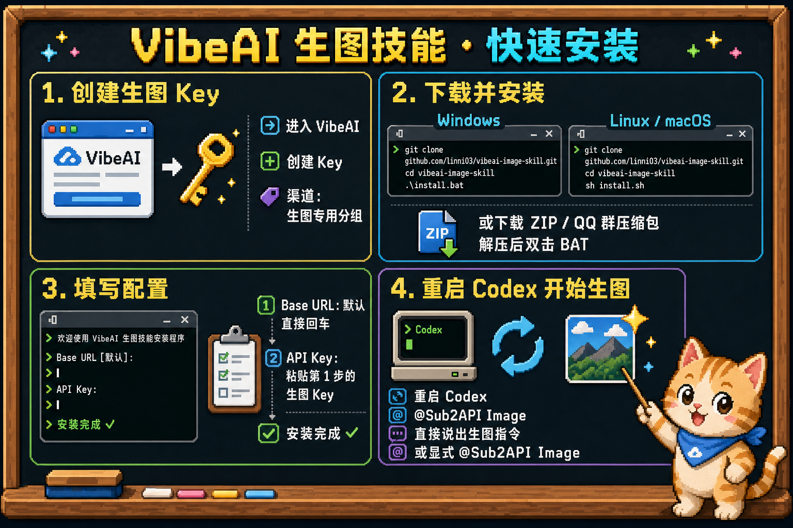

# VibeAI Sub2API 图像 Skill

这是一个供 Codex 使用的图像生成与编辑 Skill，默认使用 Sub2API 的 OpenAI OAuth 图像账号桥接。安装并配置一次后，可以直接在 Codex 对话中描述图片需求，不需要手动调用接口或安装第三方 Python 包。当前 Skill 版本为 `1.6.0`。



## 安装前准备

- 已安装并可以正常使用的 Codex
- Python 3.10 或更高版本
- 一个已启用图像生成功能的 Sub2API API Key
- 使用 Git 下载或更新时需要 Git；Windows 首次安装也可以直接下载 ZIP

## Windows 安装

### 最简单：双击安装

1. 在 GitHub 仓库页面选择 **Code > Download ZIP**。
2. 解压下载的 ZIP。
3. 双击仓库根目录中的 `install.bat`。
4. 根据窗口提示输入 Base URL 和 API Key，安装完成后按任意键关闭窗口。

`install.bat` 会依次查找 `py -3`、`python` 和 `python3`，自动选择 Python 3.10 或更高版本，不受 PowerShell 脚本执行策略影响。

### 使用 PowerShell 和 Git

```powershell
git clone https://github.com/linni03/vibeai-image-skill.git
cd vibeai-image-skill
.\install.bat
```

Windows 原生环境会使用机器作用域 DPAPI 加密 API Key，使 Codex `elevated` 沙箱使用的专用低权限用户也能解密。配置保存在 `%CODEX_HOME%\sub2api-image\config.json`；未设置 `CODEX_HOME` 时使用 `%USERPROFILE%\.codex\sub2api-image\config.json`。配置文件中不会保存明文 Key，机密性同时依赖用户目录的 Windows ACL；不要把配置复制到共享目录。

从旧版本更新时，安装器会兼容旧的当前用户 DPAPI 配置，并读取 `%USERPROFILE%\.config\sub2api-image\config.json` 后写入新位置。旧 Key 可解时会自动迁移；确实无法解密时，安装器会保留 Base URL、模型、输出目录和超时设置，并要求输入替换 Key。旧路径文件会暂时保留，确认新版正常后可以手动删除。

已经安装且配置可读时，重新双击 `install.bat` 会直接覆盖更新 Skill 并原样保留配置，不再重复询问 Base URL 或 Key。需要修改配置时运行 `install.bat --reconfigure`。

## macOS、Linux 和 WSL2 安装

```bash
git clone https://github.com/linni03/vibeai-image-skill.git
cd vibeai-image-skill
sh install.sh
```

`install.sh` 会自动查找 `python3` 或 `python`。macOS、Linux 和 WSL2 使用权限为 `0600` 的配置文件保存 API Key。

## 安装器会做什么

安装器自动识别 Windows 原生、WSL、macOS 或 Linux，并显示实际使用的 Python、Codex Home、Skill 路径和配置路径。首次安装、现有密钥不可读或显式使用 `--reconfigure` 时只会询问：

```text
Sub2API Base URL [https://images.vibeai.tech/v1]:
Sub2API 生图 API Key（输入可见）:
```

- 使用默认 Base URL：直接按回车
- 使用其他 Sub2API 地址：输入地址后按回车
- API Key 输入内容会在终端中显示，便于确认输入或粘贴是否成功；请确保周围无人查看终端
- 新配置和未声明 profile 的旧配置都使用 `sub2api-openai-oauth`；默认使用零预览 SSE
- 已经配置且旧 Key 可以读取时，可以直接按回车保留现有 Key
- 重复安装时，如果现有配置可读且没有传入覆盖参数，安装器会自动保留配置并直接升级
- 如果提示旧 Key 无法解密，必须输入替换 Key；空回车不会覆盖原配置

Skill 会安装到 `$CODEX_HOME/skills/sub2api-image`；未设置 `CODEX_HOME` 时使用 `~/.codex/skills/sub2api-image`。Windows 配置保存在 `$CODEX_HOME/sub2api-image/config.json`，并受机器作用域 DPAPI 与 Windows ACL 共同保护；macOS、Linux 和 WSL2 配置保存在 `~/.config/sub2api-image/config.json`，权限为 `0600`。

安装和配置不会生成图片、访问图像 API 或产生生图费用。安装器会暂存新版本，并在配置失败时恢复原来的 Skill，避免留下半安装状态。

## 重启并确认

安装完成后，退出并重新启动 Codex，或者新建一个 Codex 会话。然后发送：

```text
检查 sub2api-image 是否已经安装和配置，不要生成图片。
```

这项检查不会产生生图费用。

也可以直接运行本地诊断。默认模式不会联网、不会调用图像接口：

Windows：

```powershell
py -3 "$env:USERPROFILE\.codex\skills\sub2api-image\scripts\doctor.py"
```

macOS、Linux 或 WSL2：

```bash
python3 ~/.codex/skills/sub2api-image/scripts/doctor.py
```

诊断会检查 Python、配置位置、密钥是否可读取、输出目录权限，以及 Codex 配置和沙箱日志位置。需要检查 DNS、TLS 和图片入口连通性时再加 `--network`；该选项只请求同源 `/health`，不会发送生图请求或产生生图费用，也不会把健康检查误报为 API Key 认证成功。诊断输出不会包含 API Key。

## Windows 一次性 Codex 权限设置

Skill 已经把普通生图缩减为一条正式命令，但 Codex 自己的沙箱仍然决定命令能否联网以及能写入哪些目录。希望以后直接生成到“图片”目录、不再逐次审批时，可以进行一次用户级配置。

先在 PowerShell 查看 Windows 实际的图片目录；这也适用于被 OneDrive 重定向的系统：

```powershell
[Environment]::GetFolderPath('MyPictures')
```

然后编辑 `%USERPROFILE%\.codex\config.toml`。把实际图片目录合并到已有配置，不要重复创建同名 TOML 表：

```toml
sandbox_mode = "workspace-write"

[windows]
sandbox = "elevated"

[sandbox_workspace_write]
network_access = true
writable_roots = ['C:\Users\YOUR-NAME\Pictures']
```

`elevated` 是官方推荐的 Windows 原生沙箱，它使用专用低权限账户、文件权限边界和防火墙规则；如果管理员策略阻止其初始化，可以临时改成较弱的 `unelevated` 继续排查。`network_access = true` 允许工作区命令联网；`writable_roots` 允许写入图片目录。只应在你接受该权限范围时启用。修改后重启 Codex 或新建会话，可用 `/status` 确认可写根。

`approvals_reviewer = "user"` 只决定由谁审核符合条件的审批请求，不会扩大沙箱可读、可写或联网边界，因此不能单独修复沙箱报错。Windows 沙箱仍失败时，先运行 `doctor.py`，再查看 `%CODEX_HOME%\.sandbox\sandbox.log`；未设置 `CODEX_HOME` 时通常位于 `%USERPROFILE%\.codex\.sandbox\sandbox.log`。

如果仍在使用旧配置且暂时不重新安装，可以在 Windows 原生 Codex CLI 中先执行：

```text
/sandbox-add-read-dir C:\Users\YOUR-NAME\.config\sub2api-image
```

新配置迁移到 `%CODEX_HOME%` 后不再需要这条旧路径读取规则。

## 在 Codex 中使用

安装成功后直接描述需求，例如：

- 生成图片：`生成一张 2K 横向的赛博朋克城市图片，保存到当前项目目录。`
- 保存到 Windows 图片目录：`生成一张治愈的像素风景图片，2K 横向，保存到图片目录，文件名 healing_pixel_landscape_2k.png。`
- 编辑图片：`编辑 ./source.png，把背景换成雪山，保持人物不变。`
- 使用参考图：`使用 ./subject.png 作为主体，参考 ./style.webp 的色彩风格生成一张 1K 图片。`
- 指定格式：`生成一张透明背景的产品图，保存为 ./product.webp。`
- 两个独立文件：`分别生成两张图片，一张森林、一张海边；按顺序生成，任一请求异常就停止。`

如果 Codex 没有自动选择该 Skill，可以显式指定：

```text
使用 $sub2api-image 生成一张 1K 方形图片并保存到当前目录。
```

`sub2api-openai-oauth` profile 每个付费请求只允许一张输出，客户端会在联网前拒绝 `n>1`。明确要求多个文件时，Codex 会按顺序执行多个独立的 `n=1` 请求；某一步失败或计费不明确后不会继续剩余请求。“一张图里包含两个类别”和“两个类别各生成一张”是不同需求，含义不清时会先询问。

该 profile 默认使用 SSE，发送 `stream=true` 和 `partial_images=0`。这样可以利用入口 keepalive 和最终完成事件，但不会购买额外预览图。Sub2API 返回 `image_generation.completed` 或 `image_edit.completed` 后即视为终态，不要求额外 `[DONE]`。若同一请求返回普通 JSON，客户端会直接处理，不会重发。

已验证的预设为 `1K` 方形 `1024x1024`、`2K` 横向 `1536x1024`、`2K` 竖向 `1024x1536`。OAuth `1K` 横向/竖向、`2K` 方形和全部 `4K` preset 不会被猜测或静默替换，而会在联网前报错；只有明确知道后端接受某尺寸时才传精确 `--size WIDTHxHEIGHT`。返回文件仍按真实字节尺寸严格核验。

正式生成和编辑固定使用 `--timeout 600`，最多等待 10 分钟。客户端在发送前生成 `client_request_id`，把它写入 `X-Client-Request-Id`，并随 `image_request_started`、后续心跳、成功或错误 JSON 一起报告。即使 TLS 在响应头之前断开，也可以用这个 ID 检索入口和 Sub2API 日志。心跳每 15 秒输出一次；最终 JSON 单独写入标准输出。Codex 必须保留完整的结构化命令结果和原始命令 `session_id`。

Codex 会每 15 秒恢复同一个原始命令会话；`image_request_started`、`image_request_pending`、`still running`、外层 cell 无 JSON 结束、空输出和目标文件暂不存在都只是等待状态。图片提前完成时，客户端会立即保存并输出最终 JSON，不会等待满 10 分钟，也不会发起第二次生图。

满 600 秒仍未完成时，心跳会改为 `image_request_deadline_reached`。它只表示调用方截止时间已到，不证明底层网络请求已经退出。Codex 会停止同一个原始命令会话并做最后一次文件检查；因为请求可能已经到达服务端，计费结果仍可能不确定，必须先按 `client_request_id` 核对使用记录。

`--stream` 可显式固定默认 SSE 模式，`--no-stream` 可在兼容性诊断中请求单个 JSON 响应。两者都不是 TLS 或网络故障后的重试机制。

如果连接在 `image_generation.completed` 或 `image_edit.completed` 之后中断，已验证的最终图片会正常保存，并在 JSON 报告中附带 `transport_warning`。如果连接在最终事件之前中断，仅会原子保存文件名含 `partial` 的有效预览，并以失败退出；这些文件会明确标记为诊断预览，不能当作最终图片。此时计费状态可能不确定，客户端不会自动重试。

## 更新或重新配置

在仓库目录执行 `git pull`，然后重新运行对应平台的安装器：

Windows：

```powershell
git pull
.\install.bat
```

安装器会暂存并校验新版本，然后原子替换 `%CODEX_HOME%\skills\sub2api-image`。旧脚本和残留文件会被清除，Skill 目录之外的现有配置不会被删除。可读配置自动保留；需要改 Base URL 或 Key 时运行 `.\install.bat --reconfigure`。Windows 旧版的 `windows-dpapi-current-user` 配置会在这一步迁移为 `windows-dpapi-local-machine`。

macOS、Linux 或 WSL2：

```bash
git pull
sh install.sh
```

macOS、Linux 和 WSL2 同样会原子覆盖 Skill 并自动保留可读配置；需要重新配置时运行 `sh install.sh --reconfigure`。更新后请重启 Codex 或新建会话。

## 常见问题

- **Windows 提示找不到 Python**：从 [Python 官网](https://www.python.org/downloads/windows/) 安装 Python 3.10 或更高版本，然后重新双击 `install.bat`。
- **Codex 找不到 Skill**：重启 Codex 或新建会话，并尝试显式写 `$sub2api-image`。
- **提示未配置或认证失败**：重新运行安装器，检查 Base URL、API Key，以及该 Key 所属用户组是否已启用图像生成功能。
- **Windows 提示 `credential_decryption`**：先更新仓库并重新运行 `install.bat`。安装器会自动迁移可读取的旧 Key；旧 Key 确实不可读时会要求输入替换 Key，不需要先删除配置文件。
- **Windows 沙箱启动或权限失败**：优先使用 `[windows] sandbox = "elevated"`；若管理员或企业策略阻止初始化，再用 `unelevated` 作为兼容回退。运行 `doctor.py` 并检查 `.sandbox\sandbox.log`，不要把 `approvals_reviewer` 当成沙箱权限开关。
- **图片目录仍要求写入审批**：用 `/status` 检查实际 Pictures 路径是否已经出现在 writable roots，并确认路径与 `[Environment]::GetFolderPath('MyPictures')` 的输出一致。
- **Codex 很快提示图片不存在**：确认 Codex 保留的是原始命令 `session_id`，而不是只等待外层 `cell_id` 或只读取命令的 `output`。`image_request_started`、`image_request_pending`、空输出和外层 cell 无客户端 JSON 结束都不是失败。更新 Skill 后，Codex 会按 15 秒间隔恢复同一个命令，最多等待 600 秒。
- **出现 `SSL: UNEXPECTED_EOF_WHILE_READING`**：先运行 `doctor.py --network` 检查同一图片入口的 DNS、TLS 和 `/health`，再按错误里的 `client_request_id` 检查 Sub2API、反向代理和使用记录。最终完成事件之前断开时计费状态不明确，不要直接重试；改成非流式也不能证明上一笔请求未计费。
- **一次要求多张却只返回一张**：OAuth profile 不再发送 `n>1`。请明确要求多个独立输出，Codex 会按顺序逐张请求；任一请求异常后会停止，不会继续扩大潜在费用。
- **API Key 是否安全**：Windows 使用机器作用域 DPAPI 加密，并依赖用户目录 ACL 限制密文读取；同一台机器上能读取该配置文件的账户也能解密，因此不要移动到共享目录。macOS、Linux 和 WSL2 使用 `0600` 配置文件。不要把 Key 粘贴到 Codex 对话、命令参数、URL、Git 仓库或日志里。
- **是否会产生费用**：安装和配置不会产生费用；只有实际生成或编辑图片时才会消耗 Sub2API 额度。
